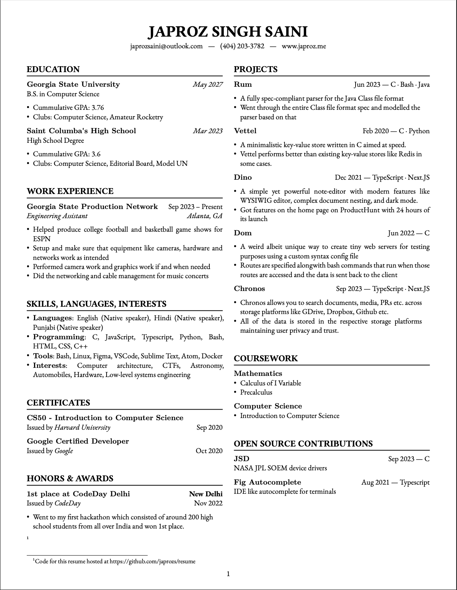
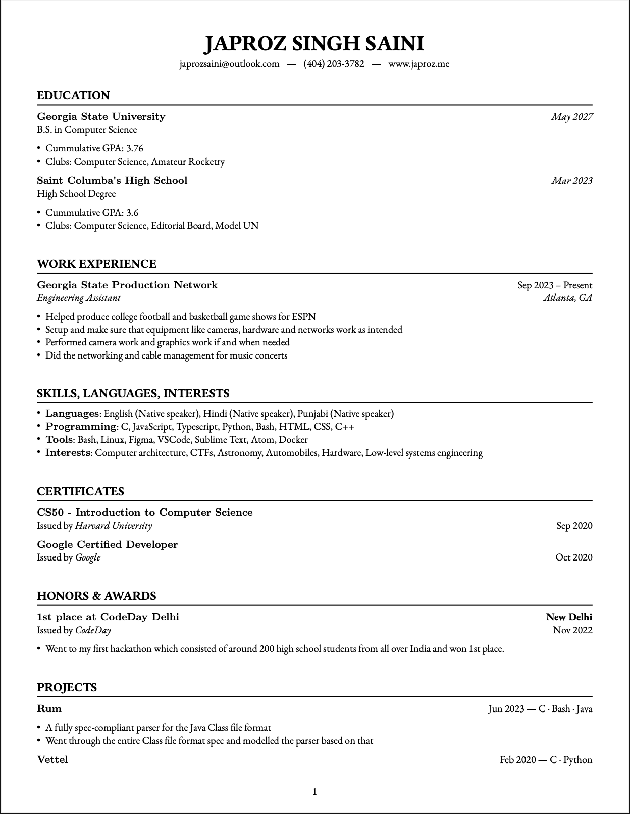

# Resume

My resume template that is built is with Typst with a configuration file. If you want to customize the data for your own use, you only have to change the [resume.yml](./resume.yml) file.

You can also customize the layout of this resume from a double-column layout by default to a single-column layout by customizing [resume.typ](./resume.typ).

The starting code for this template has been taken from https://github.com/jskherman/cv.typ

Fonts used in this template:

1. Linux Libertine
2. New Computer Modern
3. EB Garamond

## Preview

<p align="center">
  
&nbsp; &nbsp; &nbsp; &nbsp;
  
</p>

### License

```
Copyright 2024-Present Japroz Singh Saini

Permission is hereby granted, free of charge, to any person obtaining a copy of this software and associated documentation files (the “Software”), to deal in the Software without restriction, including without limitation the rights to use, copy, modify, merge, publish, distribute, sublicense, and/or sell copies of the Software, and to permit persons to whom the Software is furnished to do so, subject to the following conditions:

The above copyright notice and this permission notice shall be included in all copies or substantial portions of the Software.

THE SOFTWARE IS PROVIDED “AS IS”, WITHOUT WARRANTY OF ANY KIND, EXPRESS OR IMPLIED, INCLUDING BUT NOT LIMITED TO THE WARRANTIES OF MERCHANTABILITY, FITNESS FOR A PARTICULAR PURPOSE AND NONINFRINGEMENT. IN NO EVENT SHALL THE AUTHORS OR COPYRIGHT HOLDERS BE LIABLE FOR ANY CLAIM, DAMAGES OR OTHER LIABILITY, WHETHER IN AN ACTION OF CONTRACT, TORT OR OTHERWISE, ARISING FROM, OUT OF OR IN CONNECTION WITH THE SOFTWARE OR THE USE OR OTHER DEALINGS IN THE SOFTWARE.
```
